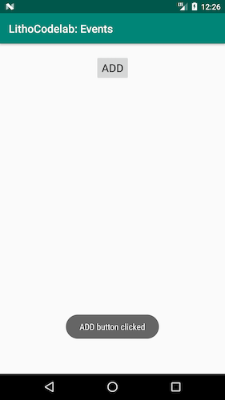
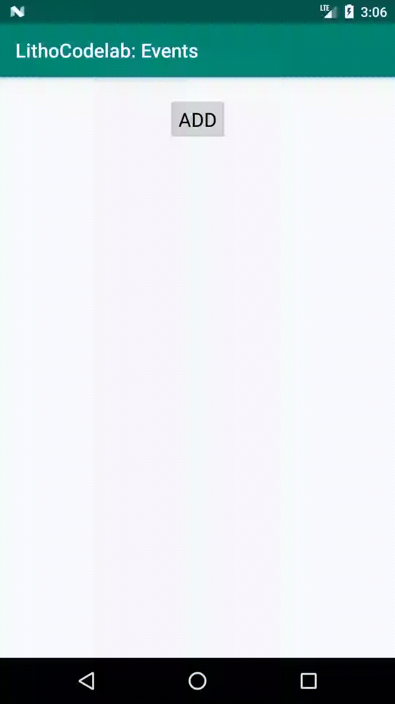
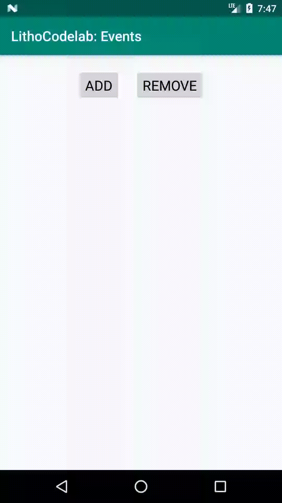
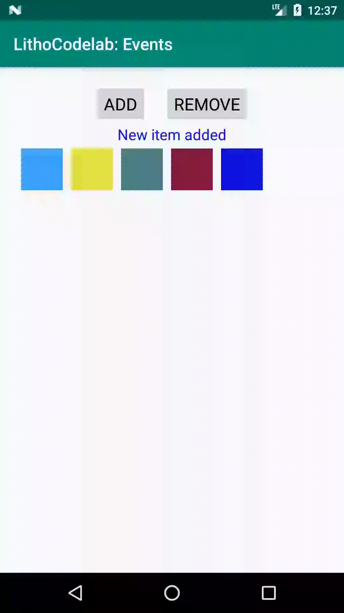
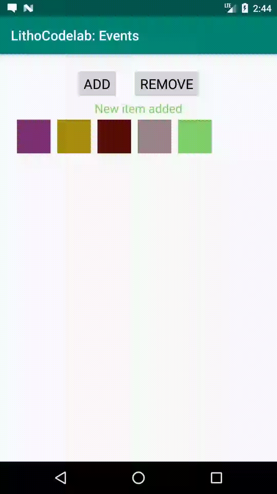

# 1. Overview

In this codelab, you'll learn about events: how to declare them, bind them to components, react to events and creating custom events.

### Prerequisites:
- `LayoutSpec`s
- State Updates

# 2. Setup the environment

Clone the following repo: [https://github.com/facebook/litho/tree/master/codelabs/events](https://github.com/facebook/litho/tree/master/codelabs/events)

# 3. Add `ClickEvent` and show message

In this part we will see how to add `ClickEvent` declaration and corresponding handler to the component. The screen will contain "ADD" button and it should show `Toast` message when clicked.

## Add button component
First, let's create a separate component for button so that we can reuse it later. In our case button is just a styled `Row` containing `Text` component:
#### ButtonSpec.kt
```kotlin 
@LayoutSpec
object ButtonSpec {

  @OnCreateLayout
  fun onCreateLayout(c: ComponentContext, @Prop text: String): Component {
    return Row.create(c, 0, R.style.Widget_AppCompat_Button_Small)
        .clickable(true)
        .child(
            Text.create(c)
                .alignSelf(YogaAlign.CENTER)
                .textSizeSp(20f)
                .text(text))
        .build()
  }
}
```

## Define `ClickEvent`
Now, let's switch to main component to define our layout. We add our `Button` component and align it horizontally to the center.

#### RootComponentSpec.kt
```kotlin
@OnCreateLayout
fun onCreateLayout(c: ComponentContext): Component {
  return Column.create(c)
      .paddingDip(YogaEdge.ALL, 20f)
      .child(
          Button.create(c)
              .alignSelf(YogaAlign.CENTER)
              .text("ADD"))
      .build()
}
```

To declare event in your component you need to add a function annotated with `@OnEvent`. That annotation accepts the class value of event type, and here we will use predefined event type for clicks: `ClickEvent`. The function will accept `ComponentContext` and any prop or state as params. We will show `Toast` message when click event is triggered:

#### RootComponentSpec.kt
```kotlin
@OnEvent(ClickEvent::class)
fun onClickEvent(c: ComponentContext) {
  Toast.makeText(c.androidContext, "ADD button clicked", Toast.LENGTH_SHORT).show()
}
```

## Add click handler to component

We now have an event declaration which on its own does not do anything. We need to bind that event to the component that will trigger it. In our case we need to add `.clickHandler` to our `Button` component and it accepts `EventHandler<ClickEvent>` type. In order to add event handler we need to first compile our code so that the generated component (`RootComponent`) contains event handler function that points to `onClickEvent` we declared earlier. We need this level of indirection so that the generated component can prefill `Prop` and `State` values that could have been declared in `onClickEvent` and provide a method where you only pass `ComponentContext`:

#### RootComponentSpec.kt
```kotlin
Button.create(c)
    .alignSelf(YogaAlign.CENTER)
    .text("ADD")
    .clickHandler(RootComponent.onClickEvent(c)))
```  

## Click event in action

We have now all pieces together and the interaction looks like the following:



The next step will be to trigger state update and perform some action in response to click.

# 4. Trigger state update on click event

In previous part we added simple click event declaration and handler. In this part we will add state to the root component and use click event to trigger state update.

## Add `ColorBoxCollection` component
To demonstrate some visual change as response to click event, we will create a new component called `ColorBoxCollection`. It renders a set of square color boxes laid out in rows. It will accept a list of colors that it will turn into corresponding square color boxes.

#### ColorBoxCollectionSpec.kt
```kotlin
@LayoutSpec
object ColorBoxCollectionSpec {

  @OnCreateLayout
  fun onCreateLayout(c: ComponentContext, @Prop items: IntArray): Component {
    val rowBuilder = Row.create(c).wrap(YogaWrap.WRAP)
    items.forEach {
      rowBuilder.child(
          Row.create(c)
              .marginDip(YogaEdge.ALL, 4f)
              .widthDip(48f)
              .heightDip(48f)
              .backgroundColor(it))
    }
    return rowBuilder.build()
  }
}
```
## Introduce state for list of colors

To keep track of added colors we will introduce new state `items` of type `IntArray`. Let's add initialization and update method:

#### RootComponentSpec.kt
```kotlin
@OnCreateInitialState
fun onCreateInitialState(c: ComponentContext, items: StateValue<IntArray>) {
  items.set(IntArray(0))
}

@OnUpdateState
fun updateItems(items: StateValue<IntArray>, @Param newItems: IntArray) {
  items.set(newItems)
}
```


## Add new component into layout of `RootComponent`

In `RootComponent` we will place `ColorBoxCollection` just below our "ADD" button. We will use the `items` state value to pass to `ColorBoxCollection`:

#### RootComponentSpec.kt
```kotlin
@OnCreateLayout
fun onCreateLayout(c: ComponentContext, @State items: IntArray): Component {
  return Column.create(c)
    ...
    .child(
        Button.create(c)
            ...
    .child(
        ColorBoxCollection.create(c)
            .items(items))
    .build()
}

```

## Generate new color and update state with new list on click

Now we can update the body of `onClickEvent` to generate new color and trigger state update method we introduced earlier. To generate new color we generate three random values and assign to each of RGB channels. As we want props and state to be immutable we get a new copy of array with new item added:

#### RootComponentSpec.kt
```kotlin
@OnEvent(ClickEvent::class)
fun onClickEvent(c: ComponentContext, @State items: IntArray) {
  val newColor = Color.rgb(Random.nextInt(256), Random.nextInt(256), Random.nextInt(256))
  RootComponent.updateItems(c, items.plus(newColor))
}
```

## Click event in action

With all pieces together here is how it looks:



The next step will be to add param to the event method.


# 5. Add `@Param` to `OnEvent`

In previous part we triggered a state update on a click event. In this part of the codelab we will demonstrate how we can add params to events.

## Add status text 

Before adding `@Param` to `OnEvent` let's first add status text to demonstrate recent actions. We will add two more states, one for the text of status change and the other for the status text color:

#### RootComponentSpec.kt
```kotlin
@OnCreateInitialState
fun onCreateInitialState(
    c: ComponentContext,
    items: StateValue<IntArray>,
    statusText: StateValue<String>,
    statusColor: StateValue<Int>
) {
  items.set(IntArray(0))
  statusText.set("")
  statusColor.set(Color.TRANSPARENT)
}

...

@OnUpdateState
fun updateTextStatus(
    statusText: StateValue<String>,
    statusColor: StateValue<Int>,
    @Param newColor: Int,
    @Param newStatus: String
) {
  statusText.set(newStatus)
  statusColor.set(newColor)
}
```

And we will place the status text between the button and the color box collection:

#### RootComponentSpec.kt
```kotlin
@OnCreateLayout
fun onCreateLayout(
    c: ComponentContext,
    @State items: IntArray,
    @State statusText: String,
    @State statusColor: Int
): Component {
  return Column.create(c)
      ... // button
      .child(
          Text.create(c)
              .alignSelf(YogaAlign.CENTER)
              .textSizeSp(18f)
              .text(statusText)
              .textColor(statusColor))
      ... // color box collection
      .build()
}
```

## Add param to click event and add "Remove" button

We will add "Remove" button next to "Add" button and will reuse same event handler as the one added for the first button. However, we need to differentiate which button sent the click event if we use the same event declaration. To do so we can add another param to our `onClickEvent` function annotated with, well, `@Param`. We can use `Boolean` to differentiate whether it was 'add' or 'remove':

#### RootComponentSpec.kt
```kotlin
@OnEvent(ClickEvent::class)
fun onClickEvent(c: ComponentContext, @State items: IntArray, @Param add: Boolean) {
  ...
}
```

When we compile `RootComponentSpec` class `onClickEvent(ComponentContext, Boolean)` function will be generated that we can use as click handlers. Let's add two buttons in layout declaration and use modified click handler and pass corresponding params to them:

#### RootComponentSpec.kt
```kotlin
@OnCreateLayout
fun onCreateLayout(
    ...
): Component {
  return Column.create(c)
      ...
      .child(
          Row.create(c)
              .justifyContent(YogaJustify.CENTER)
              .child(
                  Button.create(c)
                      .text("ADD")
                      .clickHandler(RootComponent.onClickEvent(c, true)))
              .child(
                  Button.create(c)
                      .marginDip(YogaEdge.LEFT, 20f)
                      .text("REMOVE")
                      .clickHandler(RootComponent.onClickEvent(c, false))))
      ... // status text and color box component
      .build()
}
```

## Update items and status text on add/remove action

We can now write the implementation of the modified click event. Based on `add` param we can either append a new color or remove the last item. Also we will update status text with the recent action:

#### RootComponentSpec.kt
```kotlin
@OnEvent(ClickEvent::class)
fun onClickEvent(c: ComponentContext, @State items: IntArray, @Param add: Boolean) {
  if (add) {
    val newColor = Color.rgb(Random.nextInt(256), Random.nextInt(256), Random.nextInt(256))
    RootComponent.updateItems(c, items.plus(newColor))
    RootComponent.updateTextStatus(c, newColor, "New item added")
  } else {
    if (items.isNotEmpty()) {
      RootComponent.updateItems(c, items.sliceArray(0..items.size - 2))
      RootComponent.updateTextStatus(c, items.last(), "Item removed")
    }
  }
}
```

## Add/Remove in action

With modified click event and new button for removing item it will look like this:



The next step will be to add a custom event.

# 6. Add custom event

So far we learned how to declare an event, register event handler to component and pass params to it. The event type we used until now is a pre-defined event type which the framework provides for all components, such as `ClickEvent`. What if we want to dispatch a custom event from `ColorBoxCollection` component when something changes inside that component?

## New event declaration

Let's say we want to name our custom event `BoxItemChangedEvent`. We will create a new class with the same name and annotate it with `@Event`:

#### BoxItemChangedEvent.kt
```kotlin
@Event
class BoxItemChangedEvent
```

## Define source of the event

We want to dispatch an event of this newly created type from `ColorBoxCollection` component. To do so we specify `events` param in `@LayoutSpec` annotation as following:

#### ColorBoxCollectionSpec.kt
```kotlin
@LayoutSpec(events = [BoxItemChangedEvent::class])
object ColorBoxCollectionSpec {
  ...
}
```

When we compile our code the generated `ColorBoxCollection` class will get two extra functions:

* `dispatchBoxItemChangedEvent(EventHandler)`
* `getBoxItemChangedEventHandler(ComponentContext)`

Also its builder class (`ColorBoxCollection.Builder`) will get additional function to declare that event's handler from parent:

* `boxItemChangedEventHandler(EventHandler)`

In general, a set of these functions will be generated for each different type of event that the component can dispatch.

## Trigger custom event on longpress

Now, let's say we want to trigger `BoxItemChangedEvent` when user long-presses any item in `ColorBoxCollection`. We will add longclick event handler for each item in `ColorBoxCollection`'s child components and dispatch our custom event when longclick happens:

#### ColorBoxCollectionSpec.kt
```kotlin
@LayoutSpec(events = [BoxItemChangedEvent::class])
object ColorBoxCollectionSpec {

  @OnCreateLayout
  fun onCreateLayout(c: ComponentContext, @Prop items: IntArray): Component {
    ...
    items.forEach {
      rowBuilder.child(
          Row.create(c)
              ...
              .longClickHandler(ColorBoxCollection.onLongClick(c)))
    }
    ...
  }

  @OnEvent(LongClickEvent::class)
  fun onLongClick(c: ComponentContext): Boolean {
    ColorBoxCollection.dispatchBoxItemChangedEvent(
        ColorBoxCollection.getBoxItemChangedEventHandler(c))
    return true
  }
}
```

## Register for the new event

At this point when user long-presses item we dispatch `BoxItemChangedEvent` from `ColorBoxCollection`. However, no one is listening to that event, so it is not making any visible change. Let's introduce this new event in `RootComponent`:

#### RootComponentSpec.kt
```kotlin
@LayoutSpec
object RootComponentSpec {
  @OnCreateLayout
  fun onCreateLayout(
      ...
  ): Component {
    return Column.create(c)
        ...
        .child(
            ColorBoxCollection.create(c)
                .items(items)
                .boxItemChangedEventHandler(RootComponent.onBoxItemColorChangedEvent(c)))
        .build()
  }
  
  @OnEvent(BoxItemChangedEvent::class)
  fun onBoxItemColorChangedEvent(c: ComponentContext) {
    RootComponent.updateTextStatus(c, Color.BLACK, "Item longpressed")
  }
}
```

We added new `BoxItemChangedEvent` declaration and there we are updating text status with corresponding message. We wire that event with `ColorBoxCollection` by adding event handler.

## Custom event dispatch in action

Here is the demonstration of dispatching custom event from `ColorBoxCollection` to `RootComponent`:



In the next part we will see how can we pass params when we dispatch a custom event.

# 7. Add params to custom event

In the previous part we learned how to declare and dispatch custom event. In this part we will demonstrate how to add params to dispatching event by highlighting longpressed event visually. When long-pressed we will dispatch event with highlighted item index, color and some status text. `RootComponent` receives the event and will update the status text accordingly.

## Add extra info to `BoxItemChangedEvent`

In order to dispatch extra information first we need to add extra fields to the event class. Note that as of now due to annotation processor specifics we need to tag fields as `@JvmField` when writing Kotlin so that generated class can access these as fields instead of kotlin properties.

#### BoxItemChangedEvent.kt
```kotlin
@Event
class BoxItemChangedEvent {
  @JvmField
  var newColor = 0
  @JvmField
  var newStatus = ""
  @JvmField
  var highlightedItemIndex = -1
}
```

## Dispatch event with extra info

We can modify `ColorBoxCollectionSpec` so that we can access the item's index and color when declaring `longClickHandler`. We will add `highlightedIndex` prop that can be passed from parent and make item slightly bigger when it is highlighted (longpressed): 

#### ColorBoxCollectionSpec.kt
```kotlin
@OnCreateLayout
fun onCreateLayout(c: ComponentContext, @Prop items: IntArray, @Prop highlightedIndex: Int): Component {
  ...
  items.forEachIndexed { index, color ->
    val isHighlighted = index == highlightedIndex
    rowBuilder.child(
        Row.create(c)
            ...
            .widthDip(50f * if (isHighlighted) 1.2f else 1f)
            .heightDip(50f * if (isHighlighted) 1.2f else 1f)
            .backgroundColor(color)
            .longClickHandler(ColorBoxCollection.onLongClick(c, color, index)))
  }
  return rowBuilder.build()
}
...
```

After adding fields to `BoxItemChangedEvent`, the `dispatchBoxItemChangedEvent` function in generated `ColorBoxCollection` class changes its signature to `dispatchBoxItemChangedEvent(EventHandler, int, String, int)`. We can pass params from `onLongClick` to our custom event and update status text:

#### ColorBoxCollectionSpec.kt
```kotlin
...
@OnEvent(LongClickEvent::class)
fun onLongClick(c: ComponentContext, @Param color: Int, @Param index: Int): Boolean {
  ColorBoxCollection.dispatchBoxItemChangedEvent(
      ColorBoxCollection.getBoxItemChangedEventHandler(c),
      color,
      "Item at index $index was highlighted",
      index)
  return true
}
```

## Add state for `highlightedIndex` in `RootComponent`

We are dispatching more information from `ColorBoxComponent` to `RootComponent` and we will add `highlightedItemIndex` state to keep track of recently highlighted item and pass that down to `ColorBoxComponent`:

#### RootComponentSpec.kt
```kotlin
@LayoutSpec
object RootComponentSpec {

  @OnCreateInitialState
  fun onCreateInitialState(
      ...
      highlightedIndex: StateValue<Int>
  ) {
    ...
    highlightedIndex.set(-1)
  }

  @OnCreateLayout
  fun onCreateLayout(
      ...
      @State highlightedIndex: Int
  ): Component {
    return Column.create(c)
        ...
        .child(
            ColorBoxCollection.create(c)
                ...
                .highlightedIndex(highlightedIndex)
                ...
        .build()
  }
  
  @OnUpdateState
  fun updateTextStatus(
      ...
      highlightedIndex: StateValue<Int>,
      ...
      @Param newHighlightedIndex: Int
  ) {
    ...
    highlightedIndex.set(newHighlightedIndex)
  }
}
```

## Get extra params from dispatched event

We can access extra information from the event by annotating those params with `@FromEvent` annotation. We can use that information and pass that to state update. Note that the name of the param *must* be same as the one in the event, otherwise it will produce compile-time error:

#### RootComponentSpec.kt
```kotlin
@OnEvent(BoxItemChangedEvent::class)
fun onBoxItemChangedEvent(
    c: ComponentContext,
    @FromEvent newColor: Int,
    @FromEvent newStatus: String,
    @FromEvent highlightedItemIndex: Int
) {
  RootComponent.updateTextStatus(c, newColor, newStatus, highlightedItemIndex)
}
```

## Extra event params in action

Here is the demonstration of highlighting item and displaying status message with extra info:



In the next part we will add visible and invisible events to component.


# 8. Add visible and invisible events

The last part is an example of how to use predefined visibility events. We will be adding visible and invisible events and that will change the flow of information in such a way that `ColorBoxComponent` will be solely responsible for dispatching all changes happening within itself (as opposed to previous parts where `RootComponent` was dispatching add/remove events even though add/remove was happening within `ColorBoxComponent`).

## Declare `VisibleEvent` and `InvisibleEvent`

Litho provides predefined `VisibleEvent` and `InvisibleEvent` types that are dispatched when component first enters the screen and leaves the screen accordingly. Note that visibility events work only when [incremental mount](https://fblitho.com/docs/inc-mount-architecture) is turned on (it is on by default).

Let's use that to update status text instead of triggering state update from `RootComponent`. Now we can also tell the index of item which is getting visible/invisible:

#### ColorBoxCollectionSpec.kt
```kotlin
@LayoutSpec(events = [BoxItemChangedEvent::class])
object ColorBoxCollectionSpec {

  @OnCreateLayout
  fun onCreateLayout(c: ComponentContext, @Prop items: IntArray, @Prop highlightedIndex: Int): Component {
    val rowBuilder = Row.create(c).wrap(YogaWrap.WRAP)
    items.forEachIndexed { index, color ->
      ...
      rowBuilder.child(
          Row.create(c)
              ...
              ...
              .visibleHandler(ColorBoxCollection.onItemVisible(c, color, index))
              .invisibleHandler(ColorBoxCollection.onItemInvisible(c, color, index)))
    }
    return rowBuilder.build()
  }

  @OnEvent(VisibleEvent::class)
  fun onItemVisible(c: ComponentContext, @Param color: Int, @Param index: Int) {
    ColorBoxCollection.dispatchBoxItemChangedEvent(
        ColorBoxCollection.getBoxItemChangedEventHandler(c),
        color,
        "Item at index $index is now visible",
        -1
    )
  }

  @OnEvent(InvisibleEvent::class)
  fun onItemInvisible(c: ComponentContext, @Param color: Int, @Param index: Int) {
    ColorBoxCollection.dispatchBoxItemChangedEvent(
        ColorBoxCollection.getBoxItemChangedEventHandler(c),
        color,
        "Item at index $index is no longer visible",
        -1
    )
  }
  ...
}
```

And we can remove state update when adding new item to dataset in `RootComponent`:

#### RootComponentSpec.kt
```kotlin
@OnEvent(ClickEvent::class)
fun onClickEvent(c: ComponentContext, @State items: IntArray, @Param add: Boolean) {
  if (add) {
    val newColor = Color.rgb(Random.nextInt(256), Random.nextInt(256), Random.nextInt(256))
    RootComponent.updateItems(c, items.plus(newColor))
  } else {
    if (items.isNotEmpty()) {
      RootComponent.updateItems(c, items.sliceArray(0..items.size - 2))
    }
  }
}
```

## Visible/Invisible events in action

Here is the demonstration of visible/invisible events:


# 9. Summary

In this codelab we covered how to use events in Litho. Specifically, the following topics were covered:

* How to declare event and how to add handler to it using predefined `ClickEvent`
* How to update state when certain event was triggered
* How to declare and pass event params
* How to define a custom event
* How to dispatch custom event with extra params
* How to declare and dispatch predefined `VisibleEvent` and `InvisibleEvent`

